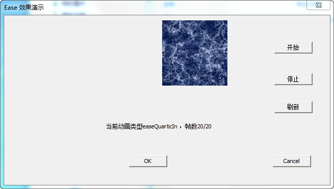

### 22种水平移动的动态效果(缓帧动画)

通过缓动函数（Easing Function）实现,算法是扩平台的，可以在windows，max，ios，android上使用。

重新封装了以下算法
http://shakddoo.tistory.com/entry/Easing-code

```c
enum EASE_TYPE
{
	ease_linear = 0,
	ease_QuadraticIn,
	ease_QuadraticOut,
	ease_QuadraticInOut,
	ease_CubicIn,
	ease_CubicOut,
	ease_CubicInOut,
	ease_QuarticIn,
	ease_QuarticOut,
	ease_QuarticInOut,
	ease_QuinticIn,
	ease_QuinticOut,
	ease_QuinticInOut,
	ease_SinIn,
	ease_SinOut,
	ease_SinInOut,
	ease_ExponentialIn,
	ease_ExponentialOut,
	ease_ExponentialInOut,
	ease_CircularIn,
	ease_CircularOut,
	ease_CircularInOut,
}EaseType;
```


*  使用方法

包含头文件Easing.h，传入窗口或者控件的位置，使定时器调用EaseFunction。


* windows下demo

<p align="center">

</p>

<hr>

### [Guide to Win32 Memory DC](./Guide-to-Win32-Memory-DC)

Guide to creating and using Memory Device Contexts (DC) in Win32.


